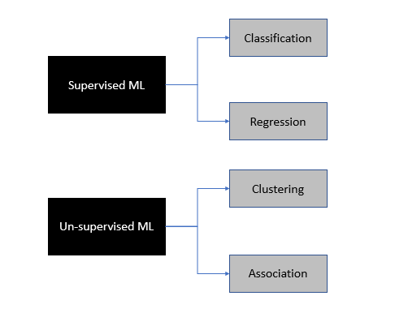
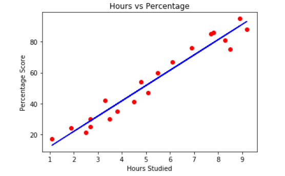
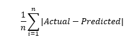
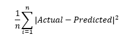

# Python-Fundamentals
## Pandas
    pip install pandas 
    import pandas as pd
    print(pd.__version__)
### FEATURES:
- Pandas were initially developed by Wes McKinney in 2008; Chang She, joined as the second major contributor to the library in 2012
- Fast and efficient for manipulating and analysing data.
- Data from different file objects can be loaded.
- Easy handling of missing data (represented as NaN) 
- Data manipulation (column insert/delete, dataset merging and joining, reshaping and pivoting of data sets etc. can be performed)
## Numpy
### INSTALLATION:    
    pip install numpy
    import numpy as np
    print(np.__version__)
 
### FEATURES:
- NumPy stands for Numerical Python 
- NumPy can be used to perform a wide variety of mathematical operations on arrays. 
- It also has functions for working in domain of linear algebra.
- NumPy arrays facilitate advanced mathematical and other types of operations on large numbers of data. 
- NumPy was created in 2005 by Travis Oliphant. 
- It is an open source project and we can use it freely. 
- NumPy is written in C and so has a faster computational speed. 

### DIFF. PANDAS & NUMPY:
- When we have to work on Tabular data, we prefer the pandas module and when we have to work on Numerical data, we prefer the numpy module. 
- The powerful tools of pandas are Data frame and Series whereas the powerful tool of numpy is Arrays. 
- Pandas consume more memory. Numpy is memory efficient. 
- Pandas has a better performance when number of rows is 500K or more.Numpy has a better performance when number of rows is 50K or less. 
- Indexing of the pandas series is very slow as compared to numpy arrays. Indexing of numpy Arrays is very fast. 
- Pandas offers two dimensional table object called DataFrame. Numpy is capable of providing multi-dimensional arrays.
## SciPy
    pip install scipy
    import scipy as sp
    print(sp.__version__)
### FEATURES:    
- SciPy is a scientific computation library that uses NumPy underneath.
- SciPy stands for Scientific Python.
- It provides more utility functions for optimisation, stats and signal processing.
- SciPy was created by NumPy's creator Travis Olliphant.
- SciPy is written in Python and so has a slower execution speed compared to numpy but vast functionality

## scikit-learn
    pip install scikit-learn
    import scikit-learn as sklearn
    print(sklearn.__version__)
    
 ### FEATURES:
 - scikit-learn is a Python module for machine learning built on top of SciPy
 - sklearn library contains a lot of efficient tools for ML and statistical modeling including classification, regression, clustering and dimensionality reduction
## Matplotlib
    pip install matplotlib
    import matplotlib.pyplot as plt
    print(plt.__version__)
### FEATURES:
- Matplotlib for creating static, animated, and interactive visualizations in Python
    
    from matplotlib import pyplot as plt # importing matplotlib module 
  
    x = [5, 2, 9, 4, 7] # x-axis values
    
    y = [10, 5, 8, 4, 2] # y-axis values
  
    plt.bar(x,y) # bar plot
    
    plt.show() # show plot
    
    
## Machine learning
### Linear Regression in Python with Scikit-Learn

- Regression predicts continuous value outputs while the latter predicts discrete outputs. 
- Classification predicts in terms of Yes/No or +1/-1

Here we will briefly study what linear regression is and how it can be implemented using the Python Scikit-Learn library.

## Linear Regression Theory
The term "linearity" in algebra refers to a linear relationship between two or more variables. If we draw this relationship in a two dimensional space (between two variables, in this case), we get a straight line.

Let's consider a use case:- 
- we want to determine the linear relationship between the numbers of hours a student studies and the % of marks that student scores in an exam. 
- we want to find out that given the number of hours a student prepares for a test, about how high of a score can the student achieve? 

If we plot the independent variable (hours) on the x-axis and dependent variable (percentage) on the y-axis, linear regression gives us a straight line that best fits the data points, as shown in the figure below.

Equation of a stright line is y = mx + b
- b is the intercept and m is the slope of the line. 
- linear regression algorithm gives us the most optimal value for the intercept and the slope (in two dimensions). 
- y and x variables remain the same, since they are the data features and cannot be changed. 
- The values that we can control are the intercept and slope. There can be multiple straight lines depending upon the values of intercept and slope. 

So, what the linear regression algorithm does is it fits multiple lines on the data points and returns the line that results in the least error.

This same concept can be extended to the cases where there are more than two variables. This is called multiple linear regression. For instance, consider a scenario where you have to predict the price of house based upon its area, number of bedrooms, average income of the people in the area, the age of the house, and so on. In this case the dependent variable is dependent upon several independent variables. A regression model involving multiple variables can be represented as:

y = b0 + m1b1 + m2b2 + m3b3 + ... ... mnbn

This is the equation of a hyper plane. Remember, a linear regression model in two dimensions is a straight line; in three dimensions it is a plane, and in more than three dimensions, a hyper plane.
    
## Accuracy Metrics

Mean absoulte error: 

Mean squared error:

